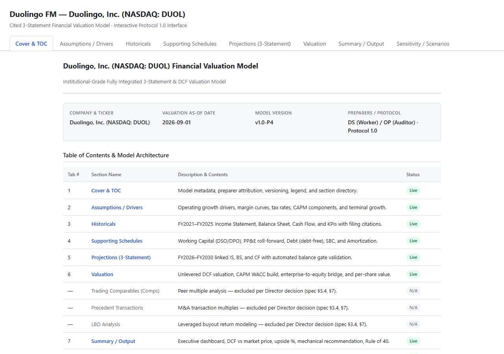
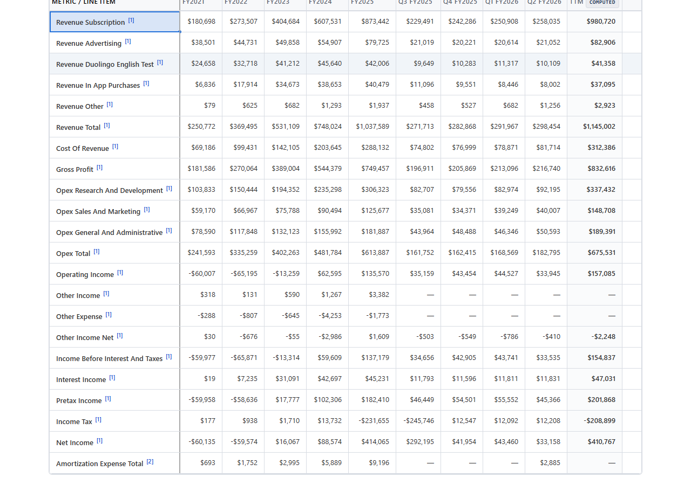
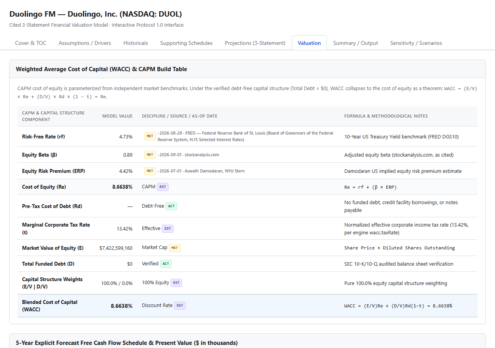
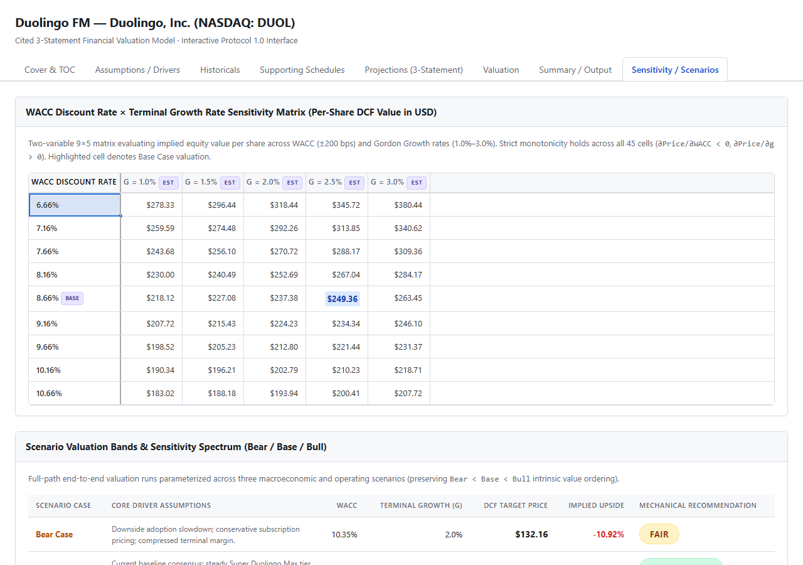

# Duolingo Financial Model & Valuation Engine (NASDAQ: DUOL)

[](tests/)
[](tests/)
[](src/data/historical/)
[](docs/sources/sources.md)
[](LICENSE)
[](package.json)

An institutional-grade, zero-runtime-dependency interactive financial model and Discounted Cash Flow (DCF) valuation suite for **Duolingo, Inc. (NASDAQ: DUOL)**. Every single one of the 706 historical data points is 100% cited to official SEC EDGAR 10-K and 10-Q filings with direct URL anchors, and every projected figure carries transparent mathematical provenance, strict estimate labeling, and sub-16ms synchronous recalculation.

---

## 1. Executive Valuation Summary

Our canonical add-back DCF model indicates that Duolingo is **Overvalued** at current market levels (P10.7 Financial Reality PASS 2026-09-26, REVALIDATED O1 2026-10-04 on 1.49 beta basis; 10-period dated-seam production, FD-denominator relatives, 3-cluster agreement verdict):

| Valuation Metric | Model Output | Benchmark / Context |
|:---|:---:|:---|
| **Market Share Price** (`MKT`) | **$157.85** | DUOL close 2026-09-02 (benchmark only; never drives intrinsic value) |
| **DCF Intrinsic Value — Current Shares** (`EST`) | **$152.15** | $152.1543 per share on 50,061,458 FD spot shares |
| **DCF Intrinsic Value — Canonical Diluted** (`EST`) | **$112.74** | $112.7414 per share after modeled future dilution (67,562,285 shares) |
| **Implied Upside (canonical)** | **−28.58%** | **OVERVALUED** (threshold $\le -15\%$) |
| **WACC (Cost of Capital)** | **11.1225%** | CAPM build ($R_f = 4.79\%$, $\beta = 1.49$, $\text{ERP} = 4.25\%$, Debt-Free) |
| **Terminal Growth Rate ($g$)** | **2.50%** | Gordon Growth perpetual rate (TV 49.69% of EV) |
| **Enterprise Value (EV)** | **$6,181,615.23k** | PV of explicit + fade FCFF + Gordon terminal on normalized FY2035 FCFF |
| **Net Cash Bridge (rolled)** | **+$1,435,448.73k** | Rolled cash ($1,199,776.73k) + STI ($132,979k) + LTI ($102,693k) − Debt ($0) |
| **Implied Equity Value** | **$7,617,063.96k** | Enterprise Value + Rolled Net Cash |
| **Current Fully Diluted Shares** | **50,061,458** | Point-in-time schedule (Basic 46,724,000 + TSM Options 520,458 + RSUs 2,817,000); WA 50,031,000 diagnostic only |
| **Relative Methods (same FD denominator)** | **Comps $138.57 (Fair) · EV/EBITDAR $114.77 (Overvalued) · P/Levered FCF $240.29 (Undervalued) · SOTP $138.57 (decomp. only) · Per-User $347.91 (Undervalued)** | 3 evidence clusters → 2/3 majority **OVERVALUED** |
| **Rule of 40** | **67.1%** | Revenue growth (+38.7%) + Adjusted EBITDA margin (28.4%), per financial-reality pack §5.1 |

### Scenario Valuation Bands (canonical diluted basis, vs market $157.85)

```
           [Bear Case]                [Base Case]                    [Bull Case]
             $61.47                     $112.74                        $238.07
            (-61.06%)                   (-28.58%)                      (+50.82%)
            OVERVALUED                  OVERVALUED                    UNDERVALUED
   |------------•--------------------------•------------------------------•------------|
 $50          $100                       $150                           $250
          (Market $157.85)
```

- **Bear Case ($61.47 / −61.06%)**: Downside drivers. Mechanical recommendation: **OVERVALUED**.
- **Base Case ($112.74 / −28.58%)**: Canonical add-back DCF after modeled future dilution (10-period dated seam, 2.5% terminal growth, 1.0% perpetual dilution). Mechanical recommendation: **OVERVALUED**.
- **Bull Case ($238.07 / +50.82%)**: Upside drivers. Mechanical recommendation: **UNDERVALUED**.

### Release Integrity (P10.8 Release Candidate)
- **Test Suite**: 1286/1286 Node tests across 82 files + 22/22 real-Chromium browser specs, 0 flakes. Manifest: `tests/manifest.json` (83 files). Read-only gates: `npm run verify:js`, `regen_pins --check`, `git diff --exit-code` + `git status --porcelain` post-test.
- **Pins**: `95972b149e0b837fd1b8d291b5902db3fb73dcff045e68a3c897fc01d58e0756` (`regen_pins --check` IN SYNC; regen refuses without the P10.7 signed pass report).
- **Financial Reality**: PASS (P10.7, 2026-09-26; REVALIDATED O1 2026-10-04 on 1.49 beta basis) — report `docs/financial_reality/phase_10_report.json` (reviewer OP, bundle `271d84f7...`, model `2e875ed8...`), ledger 90 records, pack with independent re-performance (residuals 0.0). Director countersignature pending final approval.
- **Deploy**: GitHub Pages serves the allowlisted static artifact (`index.html`, `src/`, `assets/`, `vendor/`); Vercel serves `/api/price` (GET-only, bounded, rate-limited, CORS-allowlisted). Local server binds `127.0.0.1` by default (`run.bat`; `--lan` opts in).

---

## 2. Key Product Highlights & Architecture

### The Accuracy Gate  -  100% SEC-Cited Integrity

Unlike conventional financial models with opaque spreadsheets and untraceable figures, this model enforces an **Accuracy Gate** at both build and runtime:
- **706 Historical Records**: Every historical data point in Income, Balance Sheet, Cash Flow, and KPIs is sourced from official SEC EDGAR 10-K and 10-Q filings with verified primary-filer URLs.
- **Strict Labeling Taxonomy**:
  - `ACT`  -  Audited filed actuals with SEC filing citations.
  - `EST`  -  Forward projections and subjective assumptions with explicit ranges and notes.
  - `MKT`  -  Market benchmarks with as-of timestamps and source providers.
  - `computed`  -  Dynamically derived metrics (e.g., TTM trailing computations).
- **Hybrid FY2026 Accounting**: Combines filed H1 actuals ($590,421k revenue, $78,472k operating income, $76,618k net income, $239,031k operating cash flow) with driver-based H2 projections to produce a full FY2026 forecast of $1,193,853.52k.
- **Fail-Closed Engine**: Missing drivers, invalid parameters, or mathematical inconsistencies throw typed errors rather than silently fabricating defaults.

### Architectural Overview

```mermaid
flowchart TD
    subgraph DataLayer [Data Layer - 100% SEC Cited]
        Hist[706 Historical Records\nincome.json, balance.json, cashflow.json, kpis.json]
        Assump[Assumptions & Drivers\nassumptions.json - 38 drivers]
        Ledger[Source Ledger\n7 verified SEC EDGAR URLs]
    end

    subgraph Engines [Deterministic Calculation Engines]
        Sched[Schedules Engine\nWC, PP&E, Intangibles, Debt, SBC]
        FC[Forecast Engine\nRevenue Cascade & Cost Modeling]
        ThreeSt[3-Statement Engine\nLinked IS → BS → CF Projections]
        WACCEng[WACC / CAPM Engine\nRe = Rf + Beta x ERP]
        DCFEng[DCF Valuation Engine\nGordon Growth & EV Bridge]
        RecEng[Recommendation & Sensitivity\n9x5 Matrix & Monotonicity]
    end

    subgraph AppController [Application Pipeline]
        Controller[App Controller\nDI, Clamping, <16ms Synchronous Recalc]
        TabRouter[Tab Shell Router\nARIA, Keyboard Nav, Grid Isolation]
    end

    subgraph UILayer [Presentation Layer - 8 Interactive Tabs]
        CoverTab[1. Cover / Executive Summary]
        AssumpTab[2. Assumptions & Scenarios]
        HistTab[3. Historical Financials]
        SchedTab[4. Supporting Schedules]
        ProjTab[5. Financial Projections]
        ValTab[6. DCF Valuation]
        SummTab[7. Summary & KPIs]
        SensTab[8. 9x5 Sensitivity Matrix]
    end

    DataLayer --> Engines
    Engines --> AppController
    AppController --> UILayer
```



### Zero Runtime Network Dependencies

- **Pure ES Modules**: Built with native modern JavaScript (ESM) without bundlers, transpilers, or node_modules runtime bloat.
- **Vendored Core Assets**: Tabulator 6.2.1 ESM is fully vendored with verified SHA-256 integrity checksums.
- **Offline First**: Runs completely disconnected from the internet. `index.html` and `src/` contain zero CDN imports or remote network calls.

---

## 3. Interactive 8-Tab Suite

1. **Cover & Table of Contents**: Project overview, methodology disclosures, authoritative valuation pins, and navigational index.
2. **Assumptions & Drivers**: Real-time driver adjustment with slider bounds, honest corpus notes, and instantaneous Bear/Base/Bull scenario switching.
3. **Historical Financials**: 101 metric rows spanning FY2021-FY2025 and discrete quarters, equipped with an interactive **Citations Drawer** showing filed SEC URLs.
4. **Supporting Schedules**: Complete 5-family schedule roll-forwards (Working Capital, PP&E, Intangibles & Amortization, Debt-Free Capital Structure, and Stock-Based Compensation).
5. **Financial Projections**: Fully linked 5-year IS $\rightarrow$ BS $\rightarrow$ CF statements with verified balance gate ($\text{Assets} \equiv \text{Liabilities} + \text{Equity}$ with zero diff).
6. **DCF Valuation**: Complete CAPM WACC build, present value schedule, Gordon Growth terminal value, and Enterprise Value to Equity Value bridge waterfall chart.
7. **Executive Summary**: Mechanical recommendation dashboard, Rule of 40 breakdown, and core monetization KPI summaries.
8. **Sensitivity Analysis**: 45-cell $9 \times 5$ matrix across WACC ($\pm 200\text{ bps}$) and Terminal Growth Rate ($1.0\% - 3.0\%$) with strict 2D monotonicity and $WACC > g$ guard.

---

## 4. Screenshot Gallery

| Cover & Table of Contents | Historical Financials & Citations |
|:---:|:---:|
|  |  |
| **DCF Valuation & Waterfall** | **9×5 Sensitivity Matrix** |
|  |  |

---

## 5. Performance, Memory & Accessibility Budgets

- **Recalculation Latency**: Median **~2.3ms** in-memory / **13.8ms** real-browser (Budget: $< 16\text{ms}$) across 100 consecutive driver updates. 100% synchronous engine execution with zero async/await on the hot path.
- **Cold Boot Time**: Median **~92ms** in-memory / **207ms** real-browser (Budget: $< 500\text{ms}$) from initial script load to complete 8-tab DOM hydration.
- **Memory Footprint**: Steady-state heap **~7.6MB-35MB** (Budget: $< 50\text{MB}$) after activating all 8 tabs and Tabulator data grids.
- **Accessibility & Keyboard Navigation**: Full keyboard navigation across tab lists (`ArrowLeft`, `ArrowRight`, `Home`, `End`) with grid isolation protection (arrow keys inside tables do not trigger tab switches).
- **Responsive Layouts**: Tested and validated across mobile (`390px`) and desktop (`1280px+`) viewports with responsive SVG chart scaling and sticky frozen label columns.

---

## 6. Verification & Automated Test Suite

The project includes an exhaustive automated test suite with **1286 Node tests across 82 files (357 suites)** plus **22 real-Chromium browser specs**, and **0 flakes**:

```bash
# Run complete offline test suite (read-only: must leave the tree clean)
npm test

# JS syntax gate (manifest-driven, no hand lists)
npm run verify:js

# Pin validation (read-only --check; regen refuses without P10.7 approval)
node tools/regen_pins.mjs --check

# Real Chromium suite (canonical invocation)
npx playwright test --config=playwright.config.mjs tests/browser

# Post-test cleanliness proof
git diff --check
git diff --exit-code
git status --porcelain
```

### Test Coverage Highlights
- `tests/e2e.accuracy.test.js`  -  100% figure re-verification, statement accounting identities, TTM differencing, and valuation pin encasement.
- `tests/perf.budgets.test.js`  -  Latency percentiles, cold-boot timing, heap allocation boundaries, zero-network integrity, and accessibility guards.
- `tests/threeStatement.link.test.js`  -  Full 3-statement circular integration and balance identity checks.
- `tests/wacc.build.test.js` & `tests/dcf.valuate.test.js`  -  CAPM arithmetic, Gordon Growth formulas, and debt-free theorems.
- `tests/vendor.manifest.test.js`  -  Vendored asset integrity and SHA-256 checksum verification.

---

## 7. How to Run Locally

### Prerequisites
- Node.js 20+ (for running the test suite)
- Any modern web browser (Chrome, Edge, Firefox, Safari)

### Quick Start
Clone the repository and open `index.html` directly in your browser, or start a local static server:

```bash
# Clone the repository
git clone <repository-url>
cd Duolingo-FM

# Option A: Start a local development server
npx serve .

# Option B: Run test suite
npm test
```

---

## 8. Disclaimer

This financial model is developed for educational, analytical, and portfolio presentation purposes. The valuation models, projections, and recommendations are generated algorithmically based on publicly available SEC filings and customizable macroeconomic assumptions. This project does **not** constitute financial, investment, or legal advice.
